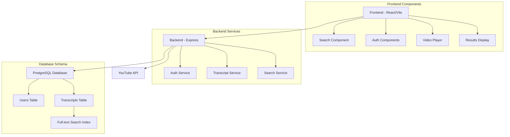

# YouTube Transcript Search Engine

A full-stack application that allows users to search through YouTube video transcripts with timestamp-based navigation. Built with React (Vite), Node.js, Express, and PostgreSQL.

## Features

- Extract transcripts from YouTube videos
- Full-text search through transcripts using PostgreSQL's built-in search capabilities
- User authentication and authorization
- Timestamp-based video navigation
- Real-time search results
- Responsive design with Tailwind CSS

## Architecture



## Prerequisites

- Node.js (v14 or higher)
- PostgreSQL (v12 or higher)
- npm or yarn

## Setup Instructions

### Backend Setup

1. Navigate to the backend directory:
   ```bash
   cd backend
   ```

2. Install dependencies:
   ```bash
   npm install
   ```

3. Create a PostgreSQL database:
   ```sql
   CREATE DATABASE youtube_transcript;
   ```

4. Set up environment variables:
   ```bash
   cp .env.example .env
   ```
   Edit `.env` with your database credentials and JWT secret.

5. Run migrations:
   ```bash
   npm run migrate
   ```

6. Start the server:
   ```bash
   npm run dev
   ```

### Frontend Setup

1. Navigate to the frontend directory:
   ```bash
   cd frontend
   ```

2. Install dependencies:
   ```bash
   npm install
   ```

3. Create environment file:
   ```bash
   cp .env.example .env
   ```
   Set `VITE_API_URL` to your backend URL (e.g., http://localhost:3000)

4. Start the development server:
   ```bash
   npm run dev
   ```

## API Endpoints

### Authentication
- `POST /api/auth/register` - Register new user
- `POST /api/auth/login` - Login user

### Transcripts
- `POST /api/transcripts` - Add new video transcript
- `GET /api/transcripts/:videoId` - Get transcript by video ID
- `GET /api/transcripts/search?q=:query` - Search through transcripts

## Database Schema

### Users Table
```sql
CREATE TABLE users (
  id UUID PRIMARY KEY DEFAULT uuid_generate_v4(),
  username VARCHAR(255) NOT NULL UNIQUE,
  email VARCHAR(255) NOT NULL UNIQUE,
  password VARCHAR(255) NOT NULL,
  created_at TIMESTAMP WITH TIME ZONE DEFAULT CURRENT_TIMESTAMP,
  updated_at TIMESTAMP WITH TIME ZONE DEFAULT CURRENT_TIMESTAMP
);
```

### Transcripts Table
```sql
CREATE TABLE transcripts (
  id UUID PRIMARY KEY DEFAULT uuid_generate_v4(),
  video_id VARCHAR(255) NOT NULL UNIQUE,
  title VARCHAR(255) NOT NULL,
  content JSONB NOT NULL,
  search_vector TSVECTOR,
  created_at TIMESTAMP WITH TIME ZONE DEFAULT CURRENT_TIMESTAMP,
  updated_at TIMESTAMP WITH TIME ZONE DEFAULT CURRENT_TIMESTAMP
);

CREATE INDEX transcript_search_idx ON transcripts USING gin(search_vector);
```

## Contributing

1. Fork the repository
2. Create your feature branch (`git checkout -b feature/amazing-feature`)
3. Commit your changes (`git commit -m 'Add some amazing feature'`)
4. Push to the branch (`git push origin feature/amazing-feature`)
5. Open a Pull Request

## License

MIT License

## Future Improvements

- Add batch processing for multiple videos
- Implement caching layer for frequent searches
- Add support for multiple languages
- Implement real-time transcript updates
- Add video thumbnail previews
- Implement advanced search filters
