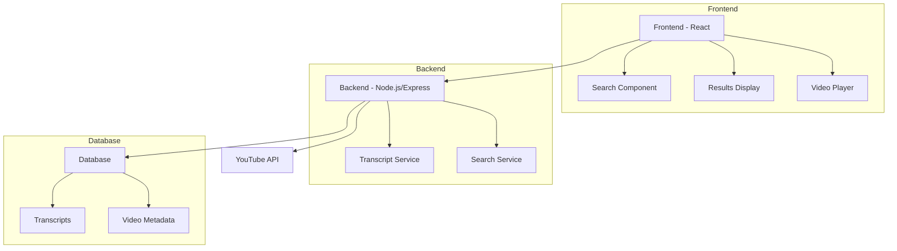

# YouTube Transcript Search Engine

A full-stack application that allows users to search through YouTube video transcripts with timestamp-based navigation.

## Features

- Extract transcripts from YouTube videos
- Store transcripts with timestamps in database
- Full-text search capabilities
- Frontend interface for searching and viewing results
- Timestamp-based video navigation

## Architecture

## Tech Stack

### Frontend
- React.js
- TailwindCSS for styling
- React Player for video playback
- Axios for API calls

### Backend
- Node.js with Express
- YouTube Transcript API
- Full-text search implementation
- RESTful API endpoints

### Database
TBD (Awaiting choice between):
- MongoDB
- PostgreSQL
- Elasticsearch

## Setup Instructions

(To be added once initial development is complete)

## API Endpoints

### Transcript Management
- `POST /api/transcripts` - Add new video transcript
- `GET /api/transcripts/:videoId` - Get transcript by video ID
- `GET /api/search?q=:query` - Search through transcripts

## Development Status
🚧 Under Development

## Contributing
Instructions for contributing will be added soon.

## License
MIT License
